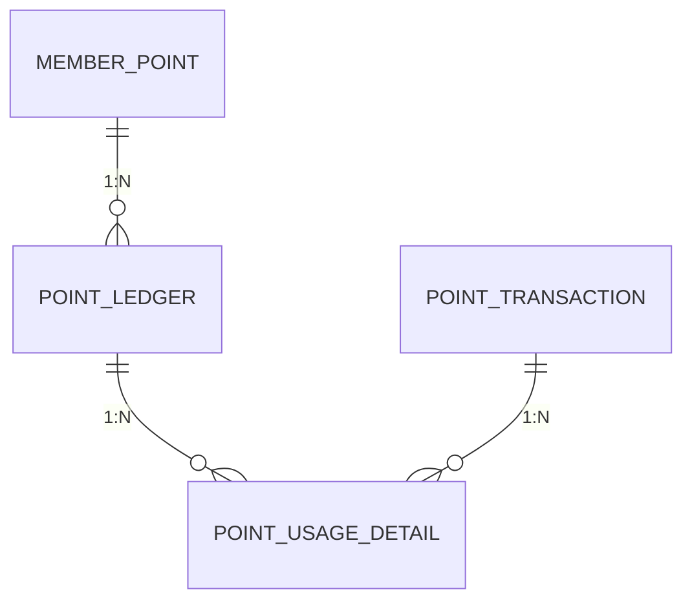

# 포인트 시스템 (Point System)

무료 포인트의 적립, 적립취소, 사용, 사용취소 기능을 제공하는 API 시스템입니다.

## 기술 스택

| 기술              | 버전    | 설명              |
|-----------------|-------|-----------------|
| Java            | 21    | 프로그래밍 언어        |
| Spring Boot     | 3.5.x | 웹 애플리케이션 프레임워크  |
| Spring Data JPA | -     | ORM 및 데이터 접근 계층 |
| QueryDSL        | 5.1.0 | 타입 안전 쿼리 빌더     |
| H2 Database     | -     | 인메모리 데이터베이스     |
| Redis           | -     | 분산락 (동시성 제어)    |
| Redisson        | -     | Redis 분산락 클라이언트 |
| JUnit 5         | -     | 테스트 프레임워크       |
| Gradle          | 8.x   | 빌드 도구           |

## 빌드 및 실행

### 사전 요구사항

- JDK 21 이상
- Gradle 8.x (또는 Gradle Wrapper 사용)

### 빌드

```bash
# 프로젝트 빌드
./gradlew build

# 테스트 제외 빌드
./gradlew build -x test
```

### 실행

```bash
# 애플리케이션 실행 (Embedded Redis 자동 시작)
./gradlew bootRun

# 또는 JAR 파일 직접 실행
java -jar build/libs/point-system-0.0.1-SNAPSHOT.jar
```

애플리케이션은 `http://localhost:8080`에서 실행됩니다.

### 테스트

```bash
# 전체 테스트 실행
./gradlew test

# 특정 테스트 클래스 실행
./gradlew test --tests "PointIntegrationTest"
```

## API 명세

### Swagger UI (API 문서)

```
http://localhost:8080/swagger-ui.html
http://localhost:8080/v3/api-docs
```

### 기본 URL

```
http://localhost:8080/api/v1
```

> **Note:** 모든 ID 필드(memberId, ledgerId, transactionId)는 **UUID** 형식입니다. (UUIDv7 사용)

### 1. 포인트 적립

**POST** `/members/{memberId}/points/earn`

포인트를 적립합니다.

**Request Body**
```json
{
  "amount": 1000,
  "earnType": "SYSTEM",
  "expirationDays": 365
}
```

| 필드 | 타입 | 필수 | 설명 |
|------|------|------|------|
| amount | Long | O | 적립 금액 (1 ~ 100,000) |
| earnType | String | O | 적립 타입 (SYSTEM: 시스템, MANUAL: 수기지급) |
| expirationDays | Integer | X | 만료일 (기본: 365일, 1 ~ 1824일) |

**Response**
```json
{
  "ledgerId": "019424a1-7c8e-7000-8000-000000000001",
  "transactionId": "019424a1-7c8e-7000-8000-000000000002",
  "memberId": "019424a1-7c8e-7000-8000-000000000000",
  "earnedAmount": 1000,
  "totalBalance": 1000,
  "expiredAt": "2027-01-10T12:00:00"
}
```

### 2. 포인트 적립취소

**POST** `/members/{memberId}/points/earn/{ledgerId}/cancel`

적립된 포인트를 취소합니다. 일부라도 사용된 경우 취소할 수 없습니다.

**Response**
```json
{
  "ledgerId": "019424a1-7c8e-7000-8000-000000000001",
  "transactionId": "019424a1-7c8e-7000-8000-000000000003",
  "memberId": "019424a1-7c8e-7000-8000-000000000000",
  "canceledAmount": 1000,
  "totalBalance": 0
}
```

### 3. 포인트 사용

**POST** `/members/{memberId}/points/use`

포인트를 사용합니다. 수기지급 포인트가 우선 사용되며, 만료일이 짧은 순서로 차감됩니다.

**Request Body**
```json
{
  "amount": 500,
  "orderId": "ORDER-12345"
}
```

| 필드 | 타입 | 필수 | 설명 |
|------|------|------|------|
| amount | Long | O | 사용 금액 |
| orderId | String | O | 주문번호 |

**Response**
```json
{
  "transactionId": "019424a1-7c8e-7000-8000-000000000004",
  "memberId": "019424a1-7c8e-7000-8000-000000000000",
  "usedAmount": 500,
  "totalBalance": 500,
  "orderId": "ORDER-12345"
}
```

### 4. 포인트 사용취소

**POST** `/members/{memberId}/points/use/cancel`

사용된 포인트를 취소합니다. 전체 또는 부분 취소가 가능합니다.
만료된 적립건의 포인트는 신규 적립건으로 복구됩니다.

**Request Body**
```json
{
  "transactionId": "019424a1-7c8e-7000-8000-000000000004",
  "cancelAmount": 300
}
```

| 필드 | 타입 | 필수 | 설명 |
|------|------|------|------|
| transactionId | UUID | O | 원본 사용 트랜잭션 ID |
| cancelAmount | Long | O | 취소 금액 |

**Response**
```json
{
  "transactionId": "019424a1-7c8e-7000-8000-000000000005",
  "memberId": "019424a1-7c8e-7000-8000-000000000000",
  "canceledAmount": 300,
  "totalBalance": 800
}
```

### 5. 잔액 조회

**GET** `/members/{memberId}/points`

회원의 포인트 잔액을 조회합니다.

**Response**
```json
{
  "memberId": "019424a1-7c8e-7000-8000-000000000000",
  "totalBalance": 800
}
```

### 6. 이력 조회

**GET** `/members/{memberId}/points/history?page=0&size=20`

회원의 포인트 거래 이력을 조회합니다.

**Query Parameters**
| 파라미터 | 타입 | 기본값 | 설명 |
|----------|------|--------|------|
| page | int | 0 | 페이지 번호 |
| size | int | 20 | 페이지 크기 |

**Response**
```json
{
  "content": [
    {
      "transactionId": "019424a1-7c8e-7000-8000-000000000002",
      "type": "EARN",
      "amount": 1000,
      "orderId": null,
      "createdAt": "2026-01-10T12:00:00"
    }
  ],
  "totalElements": 1,
  "totalPages": 1,
  "size": 20,
  "number": 0
}
```

## 주요 기능

### 적립 규칙
- 1회 적립: 최소 1원 ~ 최대 100,000원
- 개인별 최대 보유 가능: 10,000,000원
- 만료일: 기본 365일 (최소 1일 ~ 최대 1,824일)
- 수기 지급(MANUAL) / 시스템 적립(SYSTEM) 구분

### 사용 우선순위
1. 수기 지급(MANUAL) 포인트 우선 사용
2. 같은 타입 내에서 만료일이 짧은 순서로 사용

### 사용취소
- 전체 또는 부분 취소 가능
- 만료된 적립건은 신규 적립건으로 복구 (기본 만료일 365일)
- 만료일이 긴 적립건부터 복구

### 동시성 제어
- Redis 분산락(Redisson)을 이용한 회원별 동시성 제어
- 재시도 정책: 0.2초, 0.5초, 1초 간격으로 최대 3회 재시도

## 아키텍처

### 패키지 구조 (클린 아키텍처 + DDD)

```
src/main/java/com/musinsa/pointsystem/
├── presentation/          # Presentation Layer
│   ├── controller/        # REST Controllers
│   └── dto/               # Request/Response DTOs
├── application/           # Application Layer
│   ├── usecase/           # Use Cases
│   └── dto/               # Command/Result DTOs
├── domain/                # Domain Layer
│   ├── model/             # Domain Models
│   ├── service/           # Domain Services
│   ├── repository/        # Repository Interfaces
│   └── exception/         # Domain Exceptions
└── infra/                 # Infrastructure Layer
    ├── persistence/       # JPA Entities & Repositories
    ├── lock/              # Distributed Lock
    └── config/            # Configuration
```

## ERD

[ERD 문서](./reference/erd.md) 참조



### 테이블 설명

| 테이블 | 설명 |
|--------|------|
| point_policy | 포인트 정책 설정 |
| member_point | 회원별 포인트 잔액 |
| point_ledger | 적립 원장 (각 적립건) |
| point_transaction | 포인트 변경 이력 |
| point_usage_detail | 사용 상세 (1원 단위 추적) |

## 모니터링

### Health Check (Kubernetes Probes)

| 엔드포인트 | 용도 |
|-----------|------|
| `/actuator/health/liveness` | Liveness Probe (컨테이너 생존 여부) |
| `/actuator/health/readiness` | Readiness Probe (트래픽 수신 가능 여부) |

### Prometheus 메트릭

```
http://localhost:8080/actuator/prometheus
```

HikariCP, JVM, HTTP 요청 등의 메트릭을 Prometheus 형식으로 제공합니다.

## 인프라 구성

### Primary/Replica DataSource

- `@Transactional(readOnly = true)` → Replica DataSource
- `@Transactional(readOnly = false)` → Primary DataSource

로컬/테스트 환경에서는 동일한 H2 인메모리 DB를 사용하며, 프로덕션 환경에서는 AWS RDS Primary-Replica 구조를 지원합니다.

### Connection Pool 설정 (HikariCP)

| 설정 | Primary | Replica | 설명 |
|------|---------|---------|------|
| maximum-pool-size | 40 | 30 | 최대 커넥션 수 |
| minimum-idle | 20 | 10 | 최소 유휴 커넥션 |

> 100~1000 TPS 트래픽 환경에 최적화된 설정

## 참고 문서

- [요구사항 정의서](./reference/requirements.md)
- [아키텍처 설계](./reference/architecture.md)
- [데이터베이스 설계](./reference/database-design.md)
- [동시성 제어](./reference/concurrency-control.md)
- [ERD](./reference/erd.md)
- [테스트 시나리오](./reference/test-scenarios.md)
- [AWS 아키텍처](./reference/aws-architecture.md)
