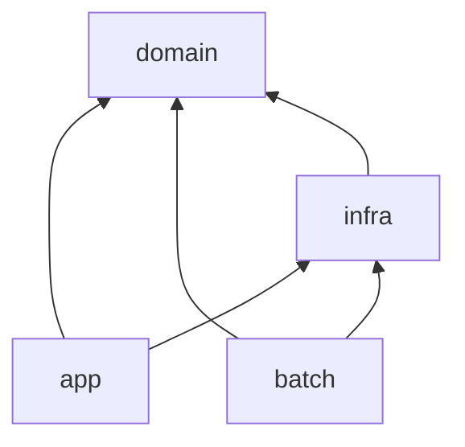
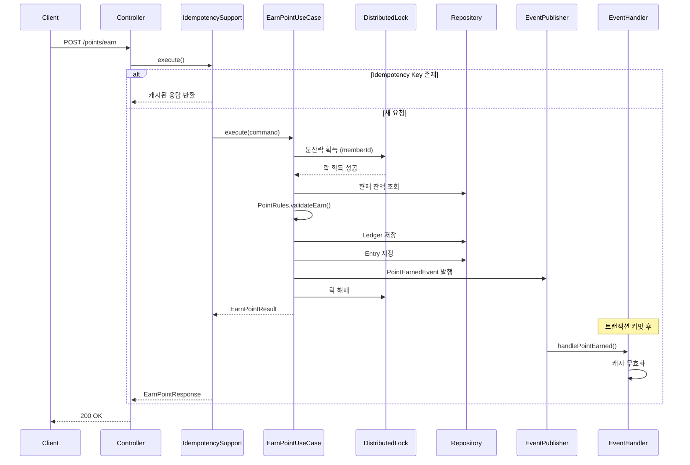
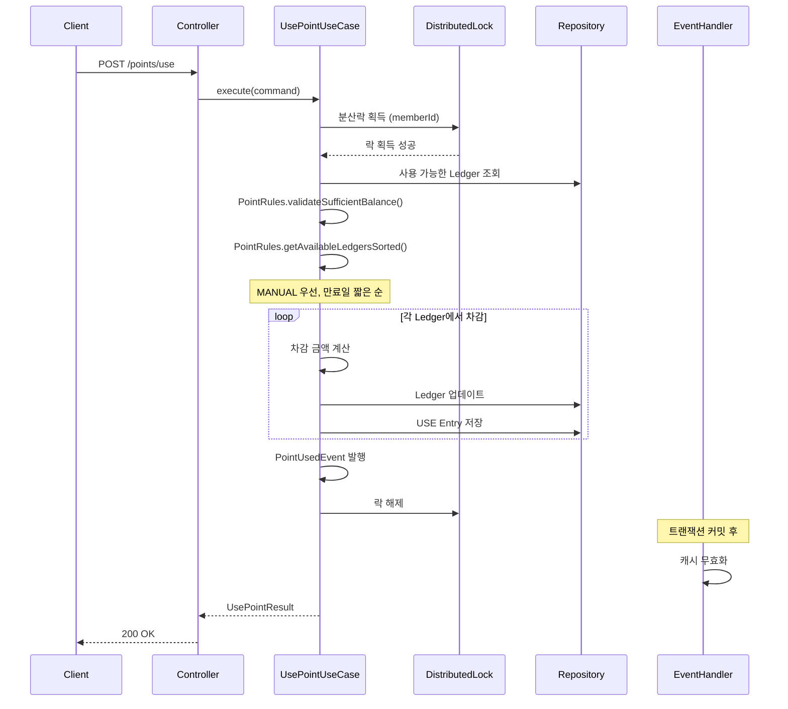
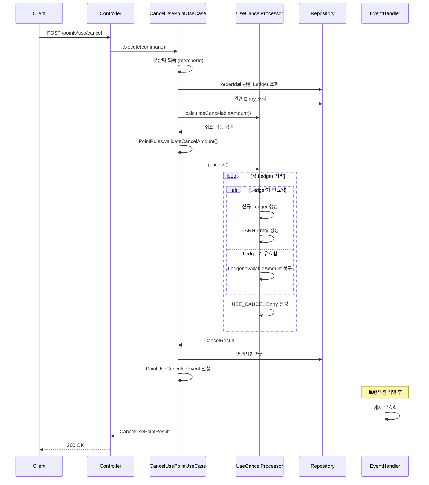
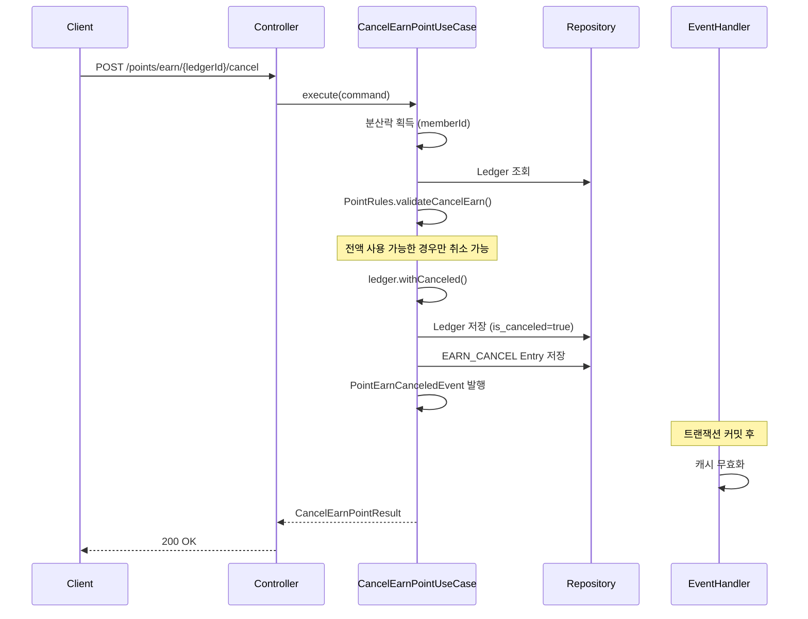

# 포인트 시스템 (Point System)

무료 포인트의 적립, 적립취소, 사용, 사용취소 기능을 제공하는 API 시스템입니다.

## 빌드 및 실행

### 사전 요구사항

- JDK 21 이상
- Gradle 8.x (또는 Gradle Wrapper 사용)

### 빌드

```bash
./gradlew build
```

### 테스트

```bash
./gradlew test
```

### 실행

```bash
./gradlew :app:bootRun
```

애플리케이션은 `http://localhost:8080`에서 실행됩니다.

### API 문서 (Swagger)

```
http://localhost:8080/swagger-ui.html
```

## 기술 스택

| 기술 | 버전 | 설명 |
|------|------|------|
| Java | 21 | 프로그래밍 언어 |
| Spring Boot | 3.5.x | 웹 프레임워크 |
| Spring Data JPA | - | ORM |
| QueryDSL | 5.1.0 | 타입 안전 쿼리 |
| H2 Database | - | 인메모리 DB (개발/테스트) |
| Redis (Redisson) | - | 분산락, 멱등성 캐시 |
| JUnit 5 | - | 테스트 프레임워크 |

---

## 아키텍처

### 클린 아키텍처 (Clean Architecture)

이 프로젝트는 Uncle Bob의 클린 아키텍처를 기반으로 설계되었습니다.

```
┌──────────────────────────────────────────────────────────────┐
│  Presentation                                                │
│  (Controller, DTO, ExceptionHandler)                         │
└──────────────────────────┬───────────────────────────────────┘
                           │
                           ▼
┌──────────────────────────────────────────────────────────────┐
│  Application                                                 │
│  (UseCase, Command/Result DTO)                               │
└──────────────────────────┬───────────────────────────────────┘
                           │
                           ▼
┌──────────────────────────────────────────────────────────────┐
│  Domain                                                      │
│  (Entity, VO, Repository Interface, Domain Service, Rules)  │
└──────────────────────────▲───────────────────────────────────┘
                           │
                           │
┌──────────────────────────┴───────────────────────────────────┐
│  Infrastructure                                              │
│  (JPA Entity, Repository Impl, Redis, Event Handler)         │
└──────────────────────────────────────────────────────────────┘
```

**의존성 방향**: `Presentation → Application → Domain ← Infrastructure`

- **Domain(중심)**: 어떤 외부 레이어도 알지 못함. 순수 비즈니스 로직만 포함
- **Application**: Domain에만 의존. 유스케이스 오케스트레이션 담당
- **Presentation**: Application을 통해 Domain에 접근. 요청/응답 변환
- **Infrastructure**: Domain의 인터페이스를 구현. DIP(의존성 역전)를 통해 Domain을 향해 의존

### 설계 의사결정: DDD Aggregate 패턴 적용 및 원복

초기에 DDD의 Aggregate 패턴을 적용하여 `MemberPoint`를 Aggregate Root로 설계했으나, 다음과 같은 이유로 현재의 단순한 구조로 원복했습니다.

**기존 DDD 구조 (MemberPoint Aggregate)**
```
MemberPoint (Aggregate Root)
├── List<PointLedger>     # 적립 원장 목록
└── List<LedgerEntry>     # 변동 이력 목록
```

**원복 이유:**

1. **메모리 효율성 문제**
   - 회원이 수백~수천 개의 적립건을 보유할 수 있음
   - Aggregate 로드 시 모든 Ledger와 Entry를 메모리에 적재해야 함
   - 특히 잔액 조회 같은 단순 연산에도 전체 데이터 로드 필요

2. **성능 최적화의 어려움**
   - DDD 원칙상 Aggregate 경계를 넘는 쿼리 최적화가 제한됨
   - `SUM(available_amount)` 같은 DB 수준 최적화 적용 불가
   - N+1 문제 회피를 위한 복잡한 Fetch 전략 필요

3. **실용적 트레이드오프**
   - 포인트 시스템은 CRUD 중심의 단순한 도메인
   - 복잡한 비즈니스 불변조건이 적어 Aggregate의 이점이 제한적
   - 현재 구조에서도 `PointRules`로 비즈니스 규칙을 명확히 캡슐화

**현재 구조의 장점:**
- `PointLedger`와 `LedgerEntry`를 독립적으로 조회/저장
- DB 수준의 쿼리 최적화 자유로움 (SUM, JOIN, 페이징)
- 메모리 사용량 최소화
- 단순하고 이해하기 쉬운 코드


### 프로젝트 구조
#### 멀티 모듈 구조
```
musinsa-point-system/
├── domain/          # 순수 도메인 (Spring 의존성 없음)
├── infra/           # 인프라 구현 (JPA, Redis, 설정)
├── app/             # REST API 애플리케이션
└── batch/           # 배치 작업
```
batch 작업을 위한 모듈을 만들면서 도메인 계층을 양측이 공유할 필요가 생겨 domain도 별도의 모듈로 분리

### 모듈 의존성



| 모듈 | 의존 대상 | 설명 |
|------|----------|------|
| `domain` | 없음 | 순수 Java, 외부 의존성 없음 |
| `infra` | `domain` | Repository 인터페이스 구현 |
| `app` | `domain`, `infra` | UseCase + REST API |
| `batch` | `domain`, `infra` | 배치 작업 |

---

## 패키지 구조

### Domain 모듈 (`domain/`)

```
domain/
├── event/              # 도메인 이벤트
│   ├── PointEarnedEvent.java
│   ├── PointEarnCanceledEvent.java
│   ├── PointUsedEvent.java
│   └── PointUseCanceledEvent.java
├── exception/          # 도메인 예외
│   ├── InsufficientPointException.java
│   ├── InvalidEarnAmountException.java
│   └── ...
├── infrastructure/     # 기술적 포트 (Cross-Cutting Concern) - 실용적 접근
│   └── IdempotencyKeyPort.java
├── model/              # 엔티티, VO, 규칙
│   ├── PointLedger.java        # 적립 원장 (핵심 엔티티)
│   ├── LedgerEntry.java        # 변동 이력
│   ├── EarnType.java           # 적립 유형 (SYSTEM/MANUAL)
│   ├── PointAmount.java        # 포인트 금액 VO
│   ├── PointRules.java         # 비즈니스 규칙 (순수 함수)
│   └── DistributedLock.java    # 분산락 어노테이션
├── repository/         # 리포지토리 인터페이스
│   ├── PointLedgerRepository.java
│   ├── LedgerEntryRepository.java
│   ├── PointQueryRepository.java
│   ├── IdGenerator.java
│   ├── BalanceCachePort.java
│   └── PointEventPublisher.java
└── service/            # 도메인 서비스
    └── UseCancelProcessor.java   # 사용취소 처리 로직
```

### Infra 모듈 (`infra/`)

```
infra/
├── adapter/            # 어댑터 (포트 구현)
│   └── UuidGenerator.java
├── cache/              # 캐시 서비스
│   └── PointBalanceCacheService.java
├── config/             # 설정
│   ├── DomainConfig.java
│   ├── RedisCacheConfig.java
│   └── RoutingDataSource.java
├── event/              # 이벤트 핸들러
│   └── PointEventHandler.java
├── idempotency/        # 멱등성 구현
│   └── IdempotencyKeyRepository.java
├── lock/               # 분산락 구현
│   └── DistributedLockAspect.java
├── metrics/            # 메트릭 수집
│   └── LockMetrics.java
└── persistence/        # JPA 구현
    ├── entity/
    ├── mapper/
    └── repository/
```

### App 모듈 (`app/`)

```
app/
├── application/        # 애플리케이션 레이어
│   ├── config/
│   │   └── DomainServiceConfig.java
│   ├── dto/
│   │   ├── EarnPointCommand.java
│   │   ├── EarnPointResult.java
│   │   └── ...
│   └── usecase/
│       ├── EarnPointUseCase.java
│       ├── UsePointUseCase.java
│       ├── CancelEarnPointUseCase.java
│       ├── CancelUsePointUseCase.java
│       ├── GetPointBalanceUseCase.java
│       └── GetPointHistoryUseCase.java
└── presentation/       # 프레젠테이션 레이어
    ├── controller/
    ├── dto/
    ├── exception/
    └── support/
        └── IdempotencySupport.java
```

---

## 도메인 모델

### PointLedger (적립건)

포인트 적립의 기본 단위입니다. 각 적립 요청마다 하나의 Ledger가 생성됩니다.

| 필드 | 타입 | 설명 |
|------|------|------|
| `id` | UUID | 적립건 ID (UUIDv7) |
| `memberId` | UUID | 회원 ID |
| `earnedAmount` | long | 최초 적립 금액 (불변) |
| `availableAmount` | long | 현재 사용 가능 금액 |
| `earnType` | EarnType | 적립 유형 |
| `sourceLedgerId` | UUID | 원본 적립건 ID (USE_CANCEL 시 참조) |
| `expiredAt` | LocalDateTime | 만료일시 |
| `canceled` | boolean | 적립 취소 여부 |
| `earnedAt` | LocalDateTime | 적립일시 |

### LedgerEntry (변동 이력)

적립건의 모든 변동을 추적하는 Append-only 이력입니다. Single Source of Truth로서 포인트 흐름을 추적합니다.

| 필드 | 타입 | 설명 |
|------|------|------|
| `id` | UUID | 이력 ID (UUIDv7) |
| `ledgerId` | UUID | 적립건 ID (PointLedger 참조) |
| `type` | EntryType | 변동 유형 |
| `amount` | long | 변동 금액 (+: 적립/복구, -: 사용/취소) |
| `orderId` | String | 주문 ID (USE, USE_CANCEL 시) |
| `createdAt` | LocalDateTime | 생성일시 |

### EarnType (적립 유형)

| 값 | 설명 |
|----|------|
| `MANUAL` | 수기 지급 (사용 우선순위 높음) |
| `SYSTEM` | 시스템 자동 지급 |
| `USE_CANCEL` | 사용취소로 인한 재적립 (만료된 적립건 복구 시) |

### EntryType (변동 유형)

| 값 | 부호 | 설명 |
|----|------|------|
| `EARN` | + | 적립 |
| `EARN_CANCEL` | - | 적립 취소 |
| `USE` | - | 사용 |
| `USE_CANCEL` | + | 사용 취소 |

---

## 시퀀스 다이어그램

### 포인트 적립 (Earn)



### 포인트 사용 (Use)



### 포인트 사용취소 (Cancel Use)



### 포인트 적립취소 (Cancel Earn)



---

## 주요 설계 결정

### UUID v7 기반 ID 설계

모든 테이블의 Primary Key로 UUID v7 (BINARY(16))을 사용합니다.

**분산 시스템 관점에서의 이점:**

1. **DB 독립적 ID 생성**
   - 애플리케이션에서 ID 생성 → DB 라운드트립 불필요
   - AUTO_INCREMENT는 DB 의존적이라 분산 환경에서 병목 발생
   - 여러 인스턴스가 동시에 ID 생성 가능

2. **시간 기반 정렬 (UUIDv7 특성)**
   - 앞 48비트가 Unix timestamp → 생성 순서대로 자연 정렬
   - B-Tree 인덱스 성능 최적화 (순차 삽입)
   - UUID v4 대비 인덱스 단편화 감소

3. **수평 확장 대응**
   - DB 샤딩 시에도 ID 충돌 없이 독립적 생성
   - 마이크로서비스 전환 시 ID 체계 변경 불필요
   - 데이터 마이그레이션/병합 시 충돌 방지

4. **BINARY(16) 저장 형식**
   - VARCHAR(36) 대비 저장 공간 56% 절약 (36바이트 → 16바이트)
   - 인덱스 크기 감소로 메모리 효율 향상
   - 비교 연산 성능 향상

### 동시성 제어

- **Redis 분산락 (Redisson)**: 회원 단위 락으로 동시 요청 제어
- **재시도 정책**: 0.2초, 0.5초, 1초 간격 최대 3회
- **타임아웃**: 락 대기 3초, 자동 해제 5초

### 멱등성 보장

- **Idempotency-Key 헤더**: 클라이언트가 생성한 고유 키
- **Redis 캐시**: 결과 저장 (TTL 10분)
  - 네트워크 장애로 인한 클라이언트 재시도는 대부분 수 초~수 분 내 발생하므로 10분이면 충분
- **3가지 상태**: ACQUIRED, PROCESSING, ALREADY_COMPLETED

### 캐시 무효화

- **트랜잭션 커밋 후 처리**: `@TransactionalEventListener(AFTER_COMMIT)`
- **이벤트 기반**: 도메인 이벤트 핸들러에서 캐시 무효화
- **데이터 정합성**: 트랜잭션 롤백 시 캐시 유지

### N+1 문제 방지 및 JPA 선택 이유

**JPA 연관관계를 사용하지 않은 이유:**
- PointLedger와 LedgerEntry 간 `@OneToMany` 매핑 시 N+1 문제 발생 가능
- 명시적 조회(`findByLedgerIds()`)로 필요한 데이터만 배치 조회

**그럼에도 JPA를 선택한 이유:**
- **QueryDSL 연동**: 타입 안전한 동적 쿼리 작성 (정렬, 필터링, 페이징)
- **Dirty Checking**: 변경 감지로 명시적 UPDATE 쿼리 불필요
- **트랜잭션 관리**: `@Transactional`과 자연스러운 통합
- **Entity-Domain 매핑**: Mapper를 통한 명확한 계층 분리

> JdbcTemplate은 단순 CRUD에 적합하나, QueryDSL 기반의 복잡한 조회와 변경 감지가 필요한 본 프로젝트에서는 JPA가 더 적합

---

## API 명세

상세한 API 스펙은 Swagger UI에서 확인할 수 있습니다.

```
http://localhost:8080/swagger-ui.html
```

### API 목록

| 메서드 | 엔드포인트 | 설명 |
|--------|-----------|------|
| POST | `/api/v1/points/earn` | 포인트 적립 |
| POST | `/api/v1/points/earn/{ledgerId}/cancel` | 포인트 적립취소 |
| POST | `/api/v1/points/use` | 포인트 사용 |
| POST | `/api/v1/points/use/cancel` | 포인트 사용취소 |
| GET | `/api/v1/points` | 잔액 조회 |
| GET | `/api/v1/points/history` | 이력 조회 |

### 공통 헤더

| 헤더 | 필수 | 설명 |
|------|------|------|
| `X-Member-Id` | O | 회원 ID (UUID) |
| `Idempotency-Key` | △ | 멱등성 키 (POST 요청 시 권장) |

### 포인트 사용 우선순위

1. 수기 지급(MANUAL) 포인트 우선
2. 만료일이 짧은 순서

---

## 설정값

| 설정        | 기본값           | 설명 |
|-----------|---------------|----|
| 1회 최소 적립  | 1원            |    |
| 1회 최대 적립  | 100,000원      |    |
| 최대 보유 한도  | 10,000,000원   |    |
| 기본 만료일    | 365일          |    |
| 최소 만료일    | 1일            |    |
| 최대 만료일    | 1,824일 (약 5년) |    |
| 멱등성 키 TTL | 10분           |    |
| 분산락 대기 시간 | 3초            |    |
| 분산락 유지 시간 | 5초            |    |

---

## 테스트

### 테스트 구조

```
tests/
├── unit/               # 단위 테스트
│   ├── PointLedgerTest
│   ├── LedgerEntryTest
│   └── PointAmountTest
├── integration/        # 통합 테스트
│   ├── EarnPointUseCaseTest
│   ├── UsePointUseCaseTest
│   ├── CancelEarnPointUseCaseTest
│   └── CancelUsePointUseCaseTest
├── scenario/           # 시나리오 테스트
│   └── IntegrationScenarioTest
└── concurrency/        # 동시성 테스트
    └── ConcurrencyTest
```